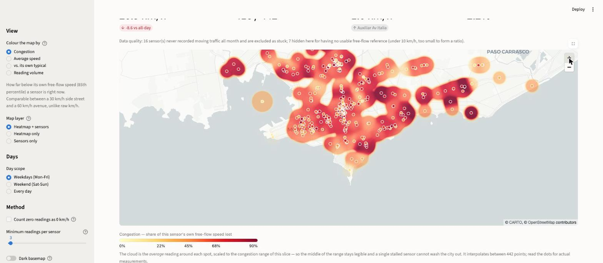

# Montevideo average speed

Interactive exploration of Montevideo's open traffic-sensor data: a city map with
a congestion heatmap and a time-of-day slider, so you can watch the rush hour
build and drain — across eight months of 2026, and crossed with the hour-by-hour
rainfall that fell on it.

Two findings, if you only read this far. **The month matters far less than the
hour**: the spread between the fastest and slowest month is 1.1 km/h, against
roughly 20 km/h between the quietest and busiest hour of a single day. And
**rain costs about 0.9 km/h, almost all of it at rush hour** — it barely touches
an empty road at 06:00 and takes 2.7 km/h off the 18:00 peak.



## Data source

The sensor readings come from [*Velocidad promedio vehicular en las principales
avenidas de Montevideo*](https://catalogodatos.gub.uy/dataset/velocidad-promedio-vehicular-en-las-principales-avenidas-de-montevideo),
published on Uruguay's open data catalogue by the Centro de Gestión de Movilidad,
Departamento de Movilidad, Intendencia de Montevideo, under the Licencia de Datos
Abiertos de Gobierno de Uruguay. A new monthly file appears once the month closes;
the current month is published while it is still running. This build covers
January to 12 August 2026 — 63 million readings.

Weather comes from [INUMET](https://catalogodatos.gub.uy/organization/inumet)'s
hourly observations, on the same catalogue, so the whole dashboard has one
provenance story. INUMET publishes seven stations nationwide and exactly one is
in Montevideo: **Aeropuerto Melilla**, in the northwest of the city. That is the
honest limitation of the weather crossing and the app says so rather than burying
it — the station is about 10 km from the middle of the sensor field, so it reports
a frontal system over the city well and a single summer cell over one avenue
badly.

Road geometry is from [OpenStreetMap](https://www.openstreetmap.org/copyright)
contributors (ODbL), and the basemap tiles are CARTO's.

Nothing in this repo is an official product of the Intendencia or of INUMET.

## Quick start

The processed parquet is committed, so the app runs with no download and no ETL:

```bash
uv sync                                    # install
uv run streamlit run src/mvdspeed/app.py   # serve
```

To rebuild it from source, or to add a month once the Intendencia publishes one:

```bash
uv run mvdspeed-fetch --from 2026-01   # ~900 MB of monthly archives
uv run mvdspeed-etl                    # every month in data/raw
uv run mvdspeed-weather                # hourly INUMET rainfall for those dates
```

`mvdspeed-fetch` enumerates the catalogue rather than guessing URLs, and is
restartable — an interrupted run costs one file, not the run. `mvdspeed-etl`
turns 63 M raw readings into an 7.7 MB parquet in about six minutes, expanding
one month at a time so peak disk stays at the archives plus ~800 MB.

Both accept `--only 2026-07,2026-08` and `--from 2026-06`. Note that the ETL is
**not** incremental by design: free-flow speed and every other "typical"
reference is computed across all the months it is given, so adding August means
re-running it over the whole panel rather than appending to it.

Road geometry for the street layer ships with the repo
(`data/streets.parquet`), so nothing else is needed. `uv run mvdspeed-osm
--refresh` re-fetches it from Overpass, which is worth doing only when the
sensor set moves onto roads the current extract does not cover.

## What the dashboard shows

- **A map, four ways.** Colour by *Congestion* (how far below its own free-flow
  speed a sensor is), *Average speed*, *vs. its own typical* (where this time of
  day is unusual for that specific spot), or *Reading volume* as a coverage
  sanity check.
- **Three ways to draw it**: the sensors as dots, a smooth heat *surface*
  between them, or the *streets* themselves — the avenues painted along their
  real OSM geometry, which is the only one of the three that does not imply the
  measurement covers ground it never saw.
- **A time-of-day slider** over 30-minute buckets, with a ▶ Play button that
  animates the full day, and an all-day-average toggle. Colours are on a fixed
  scale, so hours are comparable as it runs.
- **Day scope**: weekdays, weekend, or every day.
- **Month filter**: any subset of the published months, feeding every view.
- **Weather scope**: any weather, dry roads only, while it rained, or heavy rain
  only — applied to the map, the curves and the rankings alike.
- **The city's daily curve**, with the selected half hour marked.
- **Month against month**: each month's mean against the year, and the shape of
  the day with one month highlighted against the rest as context.
- **What rain costs**: the wet/dry penalty by time of day and by avenue, with the
  stratified and unstratified figures shown side by side.
- **Rankings and street comparison**, plus a CSV export of the current slice.

### A second page: football

**Football and traffic** crosses the panel with a hand-curated fixture list and
asks what a big match does to the city. It carries an event study around
kick-off with a placebo band, a near-the-ground-against-the-rest-of-the-city
difference, a per-sensor map, and a per-match table. The method is written up in
`src/mvdspeed/events.py`; the short version is in "Measuring a football match"
below.

The two calendars it needs are hand-typed and committed, because no feed we can
reach publishes either:

- `data/events/matches.csv` — one row per fixture with a Uruguay-local kick-off,
  a `source` and a `verified` column. Rows whose kick-off time could not be
  sourced are kept with `verified = time-unknown` and skipped by the estimator
  rather than filled in with a guess. Fixtures judged too minor to study carry
  `tier = blocked`: never offered as something to measure, but still barred from
  serving as a control day, because a clásico final is not an ordinary Sunday
  just because it has been left out of the analysis.
- `data/events/holidays.csv` — Uruguayan public holidays, working holidays and
  the bridge days around them. Not optional: Saturday 18 July 2026, *Jura de la
  Constitución*, lights up 21 consecutive half hours and is otherwise
  indistinguishable from a match evening.

Adding a fixture is editing the CSV. Nothing needs rebuilding.

## What the data actually says

Weekdays across 1 January – 12 August 2026, at 480 measuring points:

| | |
|---|---|
| Free-flow peak | **41.9 km/h** at 02:30 |
| Worst half hour | **21.8 km/h** at 17:30 |
| Morning drop | 30.4 → 25.8 km/h between 07:00 and 07:30 |
| Evening recovery | 23.7 → 26.0 km/h between 18:00 and 18:30 |

The evening peak bites harder than the morning one, and midday never recovers to
overnight speeds — the city sits on a ~24.3 km/h plateau from 08:00 to 16:00.

### The month matters far less than the hour

Eight months in, the headline is how little the months differ. Weekday means run
from **30.2 km/h in January** to **29.2 in March** — a spread of 1.1 km/h across
the whole year, against roughly 20 km/h between the quietest and busiest hour of
a single day.

| Month | Mean km/h | Slowest half hour | Sensors |
|---|---|---|---|
| Jan 2026 | 30.2 | 24.3 at 17:00 | 413 |
| Feb 2026 | 29.5 | 22.3 at 17:00 | 417 |
| Mar 2026 | 29.2 | 21.1 at 17:00 | 419 |
| Apr 2026 | 29.6 | 21.3 at 17:30 | 421 |
| May 2026 | 29.9 | 21.2 at 17:30 | 418 |
| Jun 2026 | 30.1 | 21.3 at 17:00 | 429 |
| Jul 2026 | 30.0 | 21.4 at 17:30 | 424 |
| Aug 2026 | 29.8 | 20.8 at 17:30 | 422 |

January is the outlier and the reason is not traffic engineering: Montevideo
empties in January. Its evening peak is a full 3 km/h faster than March's, which
is the first full month back at work and school. Note the sensor counts — they
are not the same set of sensors month to month, which is why the table carries
them.

### Rain costs about 0.9 km/h, and it costs it at rush hour

Crossing the panel with INUMET's hourly rainfall gives a **−0.92 km/h (−3.1%)**
weekday penalty on wet roads. But the average hides the shape:

| Time | Dry | Wet | Difference |
|---|---|---|---|
| 06:00 | 34.9 | 34.7 | −0.22 |
| 02:00–04:00 | — | — | −1.04 avg |
| 18:00 | 23.9 | 21.2 | **−2.69** |

Rain barely touches an empty road and bites hardest at 18:00, when there is
already traffic to slow down. Of 106 avenues with enough data in both
conditions, Larrañaga loses the most (−3.5 km/h, −13%), and 22 come out *faster*
in the rain — partly thinner traffic, partly small samples.

**That figure is stratified by time of day, and it has to be.** Rain does not
fall evenly across the day, so pooling every wet hour against every dry one
compares a different mix of times as much as it compares weather. Pooled, the
same data gives −1.15 km/h — about a quarter larger. The app shows both numbers
side by side rather than asking you to trust the method.

### Measuring a football match

Two mechanisms, opposite signs, and only one of them is the one people expect.

**Uruguay at the World Cup empties the city.** Across the three group matches,
city-wide speed runs **+3.4 km/h (+10.3%)** above its matched baseline for the
duration of the match — p = 0.000 against 500 placebo runs. It starts about 30
minutes before kick-off and reverses afterwards: at +150 minutes the roads are
1.1 km/h *slower* than normal as everyone leaves at once. There is no
pre-kick-off congestion at all (+0.6 km/h, p = 0.29). All three matches were
played in North America, so this is purely a broadcast effect.

**A match played in Montevideo does the opposite, and it is local.** The
city-wide view barely moves for club football — Libertadores home nights are
+0.75 km/h during the match — because the ground's own congestion and the
broadcast lull cancel. Subtracting the far ring from the near one separates
them. Across Nacional's four home matches at the Gran Parque Central, the
near-minus-far difference is:

| Minutes from kick-off | Difference | Placebo 5th–95th |
|---|---|---|
| −30 | **−1.57** | −1.00 … +0.86 |
| 0 | −1.10 | −1.05 … +0.80 |
| +120 | −1.69 | −0.83 … +0.62 |
| **+150** | **−2.54** | −0.74 … +0.58 |

Both ends clear the placebo band. Egress is the larger: over the ninety minutes
after the whistle the neighbourhood runs **−1.71 km/h** against the rest of the
city, p = 0.000. Ingress is real but *sharp* — **−1.57 km/h in the half hour
before kick-off, p = 0.004**. The single league clásico also shifts the evening
peak **45 minutes earlier** than its control days.

Three slicing decisions are doing real work in those numbers, and all three are
easy to get wrong in the direction of finding nothing:

- **The pre-kick-off window is half an hour, not ninety minutes.** Whatever
  happens before a match happens late, so a wider window averages it against
  quiet time until it disappears: the same ingress effect reads −0.45 km/h,
  p = 0.16 over the last ninety minutes, and city-wide before a Uruguay match
  it is +1.31 km/h (p = 0.032) over half an hour against +0.56 (p = 0.29) over
  ninety.

- **Only matches played at that ground count.** Pooling in the nights the same
  clubs played across town adds days on which nothing happened inside the ring
  and drags the estimate toward zero: the same ingress figure reads −0.61 km/h,
  p = 0.16, once Peñarol's three home nights are mixed in.
- **The near ring is reported against the far one, not against zero.** On a
  match night the city empties and the neighbourhood clogs at the same moment.
  The far ring gets the television and not the stadium, so the difference is the
  only line in the app that is about people travelling to a ground.

**Peñarol's ground cannot be measured this way.** The Campeón del Siglo is out
in Bañados de Carrasco and the nearest sensor is 8.1 km away, on Camino
Carrasco. The distance-banded corridor along 8 de Octubre and Camino Carrasco
comes out noisy and without a usable gradient across three home matches; it is
in the app, labelled as inconclusive. By contrast the Centenario and the Gran
Parque Central have 26 and 32 sensors inside a kilometre.

**The baseline is the whole problem.** Measured against a norm pooled over the
whole Jan–Aug panel, *every* June weekday afternoon reads 0.54 km/h slow, because
January — when Montevideo empties for the summer — sits 2.07 km/h above the same
average. That artefact has the same sign and roughly the same size as the
pre-kick-off congestion the page was built to look for. So the counterfactual is
the same sensor, the same half hour, the same weekday, on nearby dates with no
fixture and no holiday; and the uncertainty is 500 placebo runs of the identical
estimator on days when nothing happened, not a t-test that 4.4 M serially
correlated rows would drive to zero regardless.

## Reading the data honestly

The raw column `velocidad` hides three different things, and conflating them is
the easiest way to draw a wrong map. Of 62,661,014 rows across the eight months:

| | rows | treatment |
|---|---|---|
| A real speed measurement | 49,526,158 (79.0%) | used |
| Exactly `0` | 3,210,562 (5.1%) | **excluded from averages by default** |
| Empty | 9,762,711 (15.6%) | dropped — the sensor reported nothing |
| Above 120 km/h | 161,583 (0.3%) | dropped as sensor error (the file reaches 720) |

A `0` means *either* that no vehicle crossed the lane in those five minutes *or*
that traffic was completely stopped, and nothing in the file distinguishes them.
Averaging them in would drag every quiet street and every night hour toward
zero, so they are excluded by default and reported separately as the "Zero
readings" figure. The sidebar has a toggle if you want the other convention.

Five further sensor-quality rules, all in `config.py`:

- **41 sensors share one placeholder coordinate.** The feed falls back to
  `(-34.890561, -56.220631)` — a point out in the bay — when it has no real
  position, so Rambla, Belloni, Gral Flores, Bv Artigas, Bv Batlle y Ordoñez and
  Camino Carrasco all pile onto one dot in the water. Rather than hardcode that
  coordinate (next month's file may use a different one), it is caught
  structurally: a genuine point carries **at most two** street names — an
  intersection, or one street under two spellings (`Ariel` / `Camino Ariel`,
  `Gral Flores` / `SB Gral Flores`). Three or more distinct streets at identical
  coordinates means the coordinate is a fallback, not a place. Those sensors keep
  their readings in the daily curve, where position is irrelevant, and are left
  off the map and the rankings, where it is not.

- **30 of 984 lane detectors never measured moving traffic** (or never averaged
  3 km/h) across the whole panel, and are dropped before anything is aggregated.
  This test has to run per *lane*, because the raw file is one row per lane and a
  healthy lane hides a dead one when they are averaged together: `Barradas`
  (Av Italia → Rambla) advertises two lanes and one of them has never logged a
  moving vehicle. Judged at site level the site looks fine, because the other
  lane is. Eight otherwise-healthy sites had a lane dropped this way. Their
  speeds barely move — a dead lane contributes only zeros, which are excluded by
  default — but it stops them inflating lane counts and the "Zero readings"
  figure. Judging this over eight months rather than one is a real improvement:
  a lane gets 250,000 chances to show it works instead of 30,000.
- **13 sites where every lane is dead** are treated as stuck and excluded
  outright, but kept in the inventory so the exclusion stays reportable rather
  than the site silently vanishing from the totals.

- **7 sensors are not watching through traffic.** They sit pinned at 1.6–2.9 km/h
  for the fifteen hours from 07:00 to 22:00, then report 9.7–29.7 km/h at 3am.
  Real congestion clears by late evening; theirs never does. Their free-flow
  references corroborate it: 4–23 km/h where the other sensors along the same
  avenues see a median around 45. Most are probably turn lanes, bus bays or
  permanently occupied queues — real places, but not the road they are named
  after. Detected as `day_speed < 3 km/h AND night_speed > 3 × day_speed`,
  measured on weekdays, since weekend mornings dilute the daytime window enough
  to hide one of the seven. Excluded from every view, including the city curve —
  a detector stuck at 1.9 km/h all year would otherwise drag it down.
- **Congestion is a ratio**, so it is left undefined rather than faked for the 5
  sensors whose free-flow reference is under 10 km/h — at that scale the ±0.5
  km/h rounding is already worth 5%. This is what stopped a sensor crawling at
  4 km/h from being drawn as "0% congested".

Of 480 sites, **415 are mappable** at a typical rush-hour slice:
480 − 13 stuck − 7 stalled − 41 unlocatable = 419, of which 415 clear the
20-reading floor.

Street names in the source are inconsistent (`Bv Artigas` vs `Bv. Artgias`,
`Bv Espana` vs `Bv. España`, trailing spaces). The ETL trims whitespace but does
not attempt to merge misspellings, so a few streets appear twice in the
comparison picker.

### The bug that a multi-month panel exists to hit

Stitching months together sounds like concatenation. It is not, and the reason is
the sharpest example this dataset has yet produced of a failure that does not
crash.

**The publisher changed coordinate precision between March and April 2026.**
January to March carry up to eight decimal places; April onward carry exactly
six. A sensor keyed on `(lat, lon, street, from, to)` — which is how site
identity worked when the app read one file — therefore splits in two. Not
approximately: exactly 120 sensors become 240, each holding part of the year,
each computing its own "lifetime" free-flow speed from three or five months.

Nothing errors. The map grows a second dot per affected sensor, the site count
rises from 480 to 646, and every congestion figure on those sensors is quietly
measured against a reference built from a fraction of the data. It would have
looked entirely plausible.

The fix is to round to six decimals before forming the key, and the *value* is
fixed by arithmetic rather than tuned until the output looked right:

- Rounding to 6 dp moves a coordinate by at most 0.5 × 10⁻⁶°, which is **5.6 cm**
  in latitude and 4.6 cm in longitude here. Two spellings of one point can be at
  most ~7.3 cm apart. Measured worst case across the eight files: **6.9 cm**.
- Two *distinct* 6-dp coordinates differ by at least 10⁻⁶°, which is **11.1 cm**.
  Measured closest pair of genuinely different sites reporting in the same month:
  **11.1 cm**.

The artifact is strictly smaller than the smallest real separation, so rounding
cannot merge two sensors that are actually different. The independent check is
that of the 120 coordinate pairs the rounding merges, **none ever reported in the
same month** — two sites present in one month are distinct by construction, so a
single overlap would have falsified the whole argument.

What remains after the fix is real: 85 of 480 sites do not report in all eight
months, because sensors were installed, removed, or given a genuine coordinate
part-way through the year. The app says so rather than presenting a partial
reference as a yearly one.

## How the numbers are computed

The ETL aggregates to 30-minute buckets but stores **sums and counts, not
averages**, so every mean the app computes later — over any set of months, days,
hours, or streets — is exact rather than an average of averages. A "site" is one
physical measuring point; the raw file has one row per *lane*, and several lane
detectors share a coordinate. Of 984 lane detectors that reported anything usable,
954 survive the dead-lane test, and they sit at 480 sites.

Free-flow speed per sensor is its 85th-percentile non-zero reading, the standard
traffic-engineering proxy — robust to both jams and the occasional speeder. It is
computed **across every ingested month**, as are each sensor's own mean and its
day/night contrast, so congestion means the same thing in January and in August.

That percentile is taken from a per-lane **histogram** rather than from the
readings themselves. Speeds in this feed are whole km/h and capped at 120, so 121
counts per lane carry the entire distribution exactly — which turns a percentile
over 53 million readings into one over about 120,000 rows, with no sampling and
no approximation. The hand-written weighted-quantile SQL is checked against
DuckDB's own `quantile_cont` in the tests, including ties, single readings and
both extremes, because a percentile quietly a few percent off would still look
completely plausible on the map.

The rain penalty is **stratified by time of day**: differences are taken within
each half-hour bucket and only then averaged, weighted by how much wet data each
bucket has. See the rain section above for why, and `tests/test_weather_crossing.py`
for a panel where the unstratified answer comes out with the opposite sign.

## Layout

```
src/mvdspeed/
  config.py   paths, cleaning thresholds, surface parameters, palette
  fetch.py    CKAN catalogue -> monthly archives in data/raw
  etl.py      monthly archives -> parquet (duckdb), panel-wide references
  weather.py  INUMET hourly observations -> weather.parquet
  data.py     loading and slicing, including the rain crossing
  events.py   the football crossing: matched controls, placebo bands, rings
  surface.py  kernel-weighted heat surface over the point sensors
  streets.py  sensor -> road matching, and the three reach models
  osm.py      one-off Overpass fetch -> data/streets.parquet
  colors.py   value -> colour scales and legends
  charts.py   axis chrome and the categorical hues, shared by both pages
  app.py      entry point: names the pages, runs the navigation
  views/
    home.py       speed by time of day, crossed with rain
    football.py   what a big match does to traffic
data/events/
  matches.csv   hand-curated fixtures, one source URL per row
  holidays.csv  Uruguayan holidays, so they never become control days
tests/
  test_fetch.py            month-name parsing across the feed's spellings
  test_etl.py              the histogram quantile, against quantile_cont
  test_weather_crossing.py the rain stratification, on known answers
  test_events.py           the match estimator, incl. the January artefact
```

`app.py` is a twenty-line `st.navigation` router and nothing else. Streamlit's
`pages/` directory convention is cheaper to set up but takes each sidebar label
from a filename, which is fine until the entry point is itself a page — then the
label is "app": accurate about the file, useless about the contents. The pages
are listed as script paths rather than imported, so each still runs top to
bottom on its own and neither knows the other exists.

## Visual design notes

Colour is assigned by the job it does, which is why there are three scales and
no rainbow anywhere:

- **Traffic severity** (congestion, average speed) → a yellow→orange→red heat
  ramp. Multi-hue sequential is only legitimate for analogous neighbours or
  semantic heat, and this is both. It is verified strictly monotonic in OKLab
  lightness (0.988 → 0.381), which is what preserves the ordering under
  colour-vision deficiency even where the hue shift is lost.
- **A neutral count** (reading volume) → one blue hue, light to dark. It carries
  no good/bad reading, so it gets no heat.
- **Polarity** (`vs. its own typical`) → diverging red↔blue with a neutral gray
  midpoint, and it is never drawn as a heatmap, because a heat cloud cannot
  carry a +/− sign.

All scales are re-stepped for the dark basemap rather than flipped: on dark the
sequential ramps run dark→light, so the extreme value is the one that survives
against near-black (the heat ramp becomes a thermal white-hot core), and the
legend gradient reverses with it. Legends carry five labelled ticks rather than
two, so the intermediate steps can actually be decoded.

The three-colour street palette was checked with a colour-vision validator
(worst all-pairs ΔE 9.2 light / 9.4 dark); because one of those hues sits under
3:1 against the light surface, that chart ships a table view rather than relying
on colour alone.

### Why the heat cloud needed more than colour

deck.gl's `HeatmapLayer` estimates point **density** — "where are there many
events". That is the wrong statistical object for an attribute measured at fixed
stations, and no amount of colour tuning fixes it. It bins points and averages
within each bin, so **intensity depended on how many neighbours a sensor happened
to have.** The east of the city has a median of 3 sensors within 1 km against 30
in the centre, so a lone eastern sensor rendered undiluted with a hard edge while
a clustered central one was averaged toward the local mean. Carrasco read as dark
blobs on a median congestion of 0.54, against 0.52 for the rest of the city.

So the surface is computed here instead (`surface.py`), with one expression
applied identically at every point:

```
w_i     = exp(-(d_i / 500 m)^2),  zero beyond 1.2 km
value   = Σ(w_i · v_i) / Σw_i
support = Σw_i
```

Density no longer changes `value` — it changes `support`, which becomes opacity
(sublinear: support spans 0.02–52, so a linear map would leave all but the
densest cells invisible; the reference and exponent matter, see
`SURFACE_ALPHA_*`). Cells with no sensor inside the cutoff are fully transparent,
so unmeasured ground stays bare instead of being interpolated across. About
10,200 cells build in ~45 ms and 38% of them end up supported.

**It still renders as a smooth heatmap**, because the grid is drawn as a single
texture: the raster is tinted in numpy, PNG-encoded to a ~17 KB data URI (28 ms),
and handed to a `BitmapLayer`, where the GPU interpolates between cell centres.
Drawing it as thousands of `GridCellLayer` squares was the first attempt and read
as visibly pixelated. Two notes for anyone touching this:

- The image must be wrapped in `pdk.types.String(...)`. pydeck serialises plain
  strings as accessor expressions, so a bare data URI arrives as
  `"@@=data:image/png;..."` and deck.gl dies parsing it at the colon — the same
  trap that silently broke `aggregation="MEAN"` earlier.
- Image rows run north-to-south while the grid is built south-to-north, so the
  raster is flipped on encode, and `bounds` is the grid's outer edge rather than
  the corner cell centres. Getting either wrong offsets the surface against the
  dots.

Unsupported cells still get a colour (the ramp's low end) and are hidden with
alpha alone, so bilinear filtering has no black to bleed in from at the edges.

### Colouring the avenues instead

The surface fixed *how* the estimate was computed but not *what shape* it was
drawn as. Painting an area still implies areal support for a linear measurement:
a sensor watches one stretch of one avenue, not the neighbourhood around it. The
street layer draws the roads themselves (`streets.py`), which also disposes of
the surface's worst artefact for free — a coastal sensor can no longer bleed
1.2 km out over the bay, because there is no road there to paint.

The matching this needs looked like the hard part and turned out not to be, once
the question was asked the right way round. Matching `Bv. Artgias` to `Bulevar
General Artigas` from the string alone is hard. But every sensor already carries
a coordinate, so **proximity does the join and the name only disambiguates**
between the two-to-four roads meeting at that corner — a much easier job.
Names are compared on normalized tokens (accents stripped, `Avenida`/`Bulevar`/
`General` dropped), with two rules that each pay for themselves:

- a single-letter token matches a word beginning with it, which is what carries
  `L A de Herrera` to `Avenida Luis Alberto de Herrera`;
- on tokens of five characters or more, a `difflib` ratio of 0.85 counts as a
  match, which absorbs `artgias` → `artigas` (0.86) while correctly rejecting
  `colonia` → `colorado` (0.67). An earlier four-character prefix rule accepted
  both, and quietly painted the wrong avenue.

That lands **392 of the 406 mappable sites (97%)** on a road. The 14 that miss
are genuinely not streets — `Salida Pereira Rossell`, `Tunel Av Italia`,
`Entrada Nuevocentro`, `Circ Batlle W` — and they are left as dots and counted in
the data-quality line rather than snapped to whatever road happens to be nearest.
Painting a whole avenue from a sensor that was really watching the cross street
is a worse failure than admitting the miss.

Two details that are load-bearing:

- Corridors are grouped by normalized name and then split into spatially
  connected components, because two unrelated streets can share a name at
  opposite ends of the city and merging them lets one sensor's colour teleport
  across town. Endpoint matching alone would not do it either: a dual
  carriageway like Bv Artigas is two parallel ways that never touch, so ways are
  joined when their vertices land in the same ~100 m cell.
- Distances are plain euclidean, but only ever taken *within one corridor*, and
  that is what lets them stand in for distance along the road without a routing
  graph. Sensors on the far side of the block are not candidates because they
  are on a different corridor, not because the geometry says so.

**Three reach models**, because "how much of the avenue may one sensor speak
for" is a question about what you want to see, not one with a correct answer:
*blend* is the surface's Gaussian confined to the road, smooth and interpolating;
*nearest* hands the stretch to the closest sensor outright at the midpoint, so
every painted metre is one real measurement; *stub* paints only 250 m either side
and leaves the rest bare, which is the most literal thing the data supports.
All three share the geometry and differ only in how a chunk picks its value, and
all three feed opacity from the same kernel weight so the confidence channel
keeps meaning one thing across them.

Roads are drawn as ~60 m chunks, each its own two-point `PathLayer` path so it
can carry its own colour. Those want **butt caps, not rounded**: at city zoom a
60 m chunk is about as long as the line is wide, so rounded caps turn every one
of them into a circle and the avenue renders as a string of beads.

Two things fall out of this for free. Cell colours come from the **same**
`colors.sequential()` / `colors.diverging()` the dots use, so the two layers
cannot drift onto different scales — a bug that had to be fixed twice while the
`HeatmapLayer` maintained its own `colorDomain`. And `vs. its own typical` can
now be drawn as a surface: a cell holding a mean *signed* deviation is
meaningful, where a density cloud could not carry a sign at all.

## Caveats

- Seven and a half months is not a seasonal baseline either. It covers one
  Southern-Hemisphere summer and part of one winter, with no second year to tell
  a seasonal pattern from a one-off. January looks fast because Montevideo goes
  on holiday, but this panel cannot prove that is what January does.
- 85 of 480 sites do not report in all eight months, so a month-to-month
  difference is partly a change in the city and partly a change in which sensors
  were watching. The month table carries the sensor counts for that reason.
- **The rain crossing is one station.** INUMET has exactly one in Montevideo,
  ~10 km northwest of the middle of the sensor field. Frontal rain covering the
  whole city is measured well; a convective cell over one avenue may be recorded
  when that avenue stayed dry, or missed when it did not. That error is
  uncorrelated with traffic, so it dilutes the measured penalty toward zero
  rather than inventing one — the real effect is probably a little larger than
  −0.92 km/h, not smaller.
- Weather is hourly against 30-minute buckets, so both halves of an hour inherit
  its rainfall: rain starting at 10:40 is credited to all of 10:00–11:00.
- **The rain figure is an association, not a causal estimate.** Rain arrives with
  wind, cloud, and different traffic volumes, and none of those are held fixed.
  Time of day and day-of-week are; nothing else is.
- Sensors sit at intersections on monitored corridors, so coverage is not
  uniform across the city — absence of dots is not absence of congestion.
- The surface is an average, so it softens the extremes: cell values span
  0.25–0.68 (p5–p95) where raw sensors span 0.09–0.93. The dots carry the real
  measurements.
- It bleeds over water near the Rambla — a coastal sensor supports cells up to
  1.2 km offshore and there is no coastline polygon here to mask against. The
  street layer does not have this problem, since it only paints roads.
- The street layer's distances are euclidean within a corridor, which stands in
  for distance along the road only while the road does not double back on itself
  inside the cutoff. The Rambla rounding Punta Carretas is the case where it
  does, and a sensor there reaches slightly across the point rather than around
  it.
- 15 of the 419 mappable sensors match no road and appear only as dots. They are
  mostly slip roads and tunnel approaches that the feed names as streets.
- `data/streets.parquet` is a snapshot of OSM taken in May 2026. Nothing breaks
  as the city changes; corridors just stop reflecting recent roadworks.
- The basemap tiles come from CARTO's CDN, so the map needs network access
  (no API key required). The road geometry does not — it ships with the repo.
